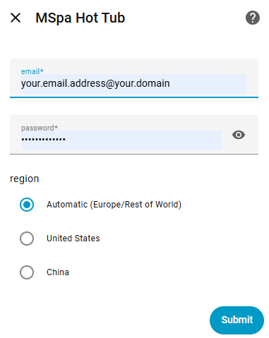
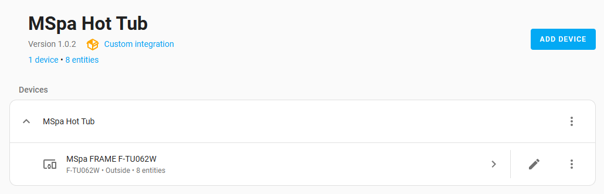
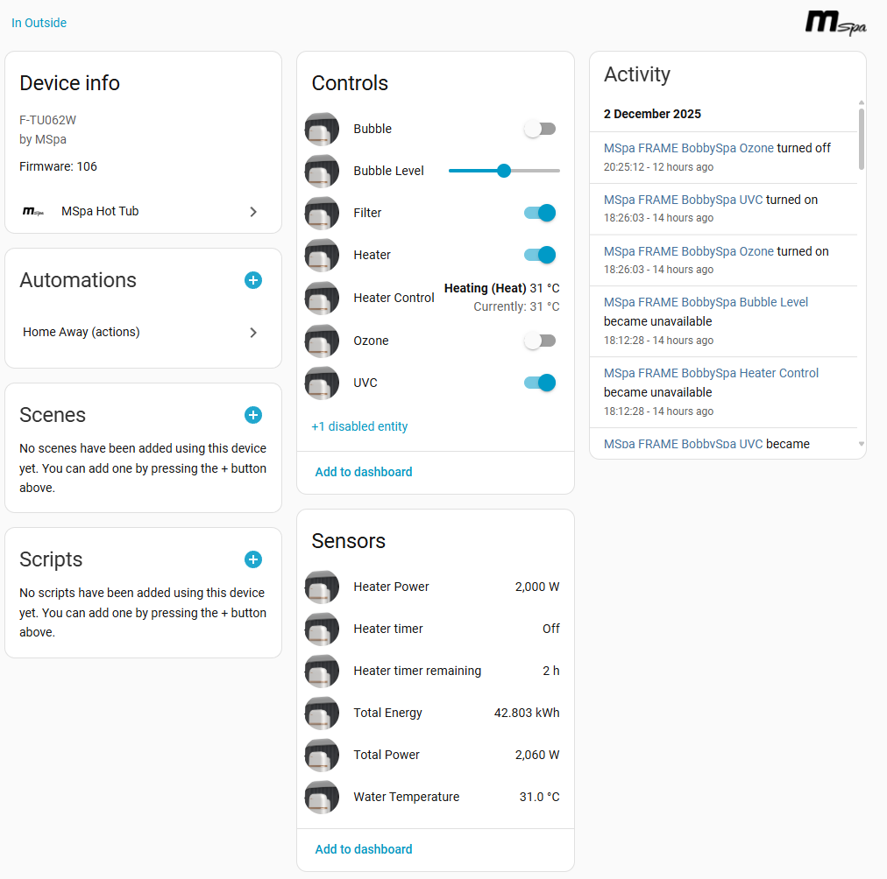
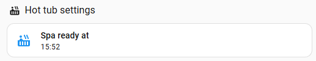
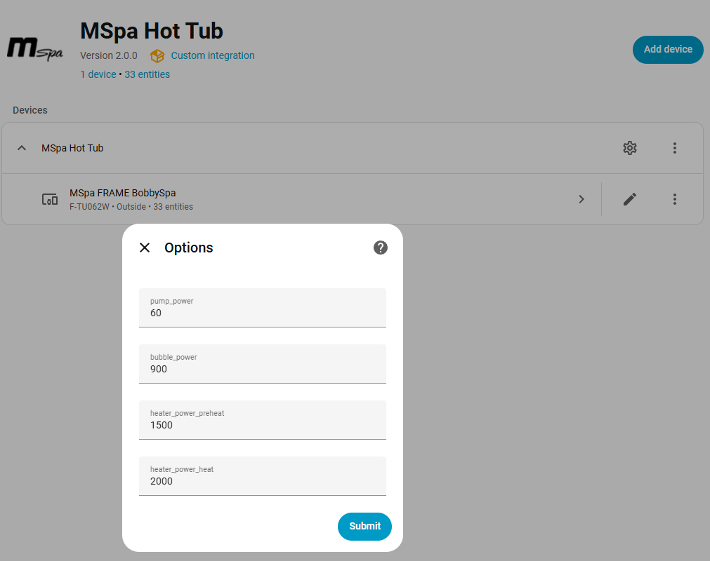
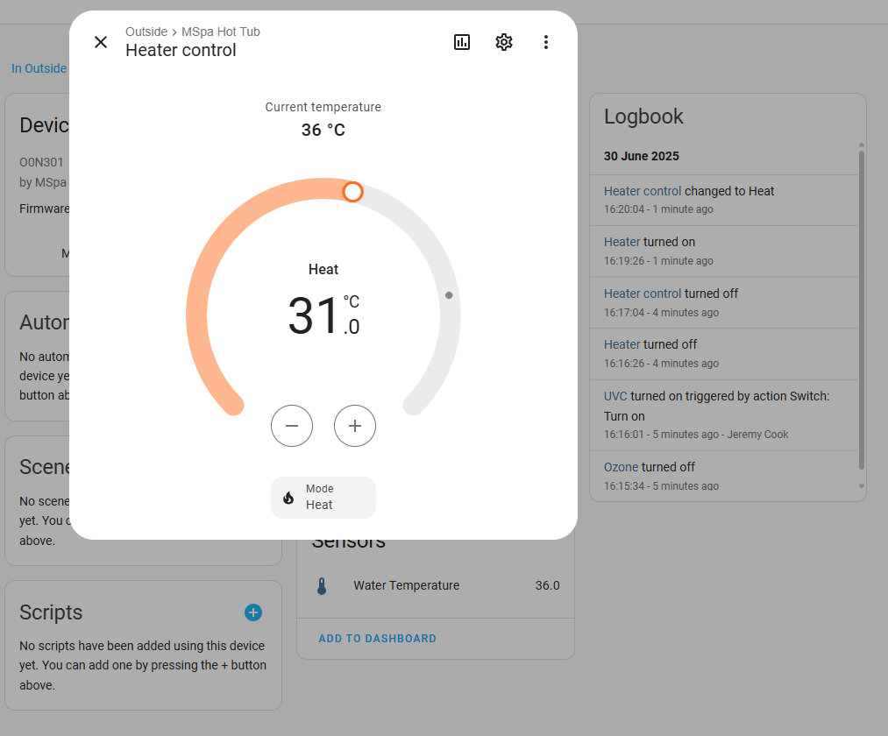
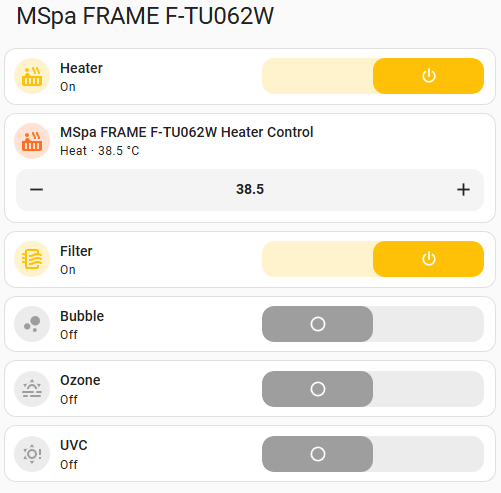

# MSpa Custom Component Integration and Installation via HACS

[![hacs][hacs-badge]][hacs-url]
[![Validate with HACS][hacs-validation-badge]][hacs-validation-url]
![Maintenance][maintenance-badge]
[![release][release-badge]][release-url]
![GitHub Downloads (all assets, all releases)][downloads-badge]
![GitHub Downloads (all assets, latest release)][downloads-latest]


This repository contains a custom Home Assistant component. You can easily install it using [HACS](https://hacs.xyz/).

## Overview

This custom Home Assistant integration implements a device to control an MSPA hot tub.  
It allows users to monitor and control various functions of their MSPA hot tub directly from Home Assistant, enabling automation and remote management.

Key features:
- Turn the hot tub on or off
- Adjust temperature settings
- Control bubbles and filtration
- Monitor current status and temperature

Refer to the installation and configuration instructions below to get started.

## Installation

1. **Install via HACS:**
    - In Home Assistant, go to **HACS** > **Integrations**.
    - Search for **MSpa** or **MSpa Hot Tub**.
    - Click on the integration to open it, then click **Download**.

2. **Restart Home Assistant:**
    - Go to **Settings** > **System** > **Restart** to apply the changes.
    - Alternatively, Home Assistant will provide a "repair" in settings that you may click on to restart Home Assistant. 

3. **Configure the Integration:**
    - Follow the documentation or configuration instructions specific to this component below.


## Configuration

After installation, you will need to configure the integration in Home Assistant. Before carrying out these steps it is recommended to 
create a guest account on the MSPA Link app to avoid using your main account credentials. Refer to the article here 
to create a guest account: [Creating a Guest Account in the MSPA Link App](MSPA_LINK.md).

To configure the MSPA integration in Home Assistant:

1. Go to **Settings** > **Devices & Services**.
2. Click on **Add Integration**.
3. Search for **mspa** and select it.
4. Enter the required information:
    - `email`: Your guest email for the MSPA account.
    - `password`: The MSPA account password for the guest user.
    - `region`: The integration will auto-detect your region based on your Home Assistant country setting. You can override this if needed:
      - **ROW (Rest of World/Europe)**: For European and other global regions (api.iot.the-mspa.com)
      - **US**: For United States and Canada (api.usiot.the-mspa.com)
      - **CH**: For China, Hong Kong, and Macau (api.mspa.mxchip.com.cn)

    
    
    > **Note on Multi-Region Support**: Multi-region support is **new and experimental**. While the ROW (Europe) region is well-tested, the US and CH regions have had limited testing. The region endpoints were identified from the [openHAB MSpa binding](https://github.com/weymann/openhab-addons/tree/main/bundles/org.openhab.binding.mspa). If you use the US or CH regions, please provide feedback on whether the integration works correctly in your region by opening an issue on GitHub.

5. Click **Submit** to complete the configuration.
6. If the registration is successful, you will see your device and some entities for monitoring and controlling it.
7. You can now add the entities to your dashboard or use them in automations.

   - **Example Entities:**
     - `switch.mspa_hot_tub_heater`: To turn the hot tub on or off.
     - `sensor.mspa_hot_tub_water_temperature`: To monitor the current temperature.
     - `sensor.mspa_hot_tub_heater_power`: To monitor the current power consumption.
     - `switch.mspa_hot_tub_bubbles`: To control the bubbles.
     - `switch.mspa_hot_tub_filter`: To control the filtration system.
     - `sensor.mspa_hot_tub_fault`: To monitor the current fault status.

## Integration page



## Device page



## Enabling the Filter status Sensor

If your MSpa device supports filter status monitoring, a `Filter status` sensor will be available in Home Assistant after installing or upgrading this integration.  
By default, diagnostic sensors like the Filter state sensor are disabled in the entity registry. It should state in
the manual for your mspa whether your mspa supports filter status monitoring.

To enable it:

1. Go to **Settings** > **Devices & Services** > **Entities** in Home Assistant.
2. Search for `Filter status` under your MSpa device.
3. Click the `Filter status` sensor and enable it.

The Filter status sensor will show `OK` when the filter is clean, and `Dirty` if the filter needs to be changed (when the warning code is `A0`).

## Starting the heater

The spa will not heat without water moving through it, so **every heater-on goes
through the circulation pump first**:

1. start the pump
2. wait for the spa to confirm it
3. start the heater

This applies wherever the request comes from — switching the climate entity to
`heat`, the heater switch, the `mspa.set_heater` action, or the predictive
scheduler starting a session by itself. If the pump is already running, the heater
starts straight away.

If the pump will not start, **the heater is not commanded** and the request fails
with an error rather than leaving the spa trying to heat dry. The scheduler treats
that as a failed start and retries on its next poll.

The MSpa Link app behaves the same way, which is why it never lets you enable
heating on its own.

## Heating action (hvac_action)

The integration also provides `hvac_action` as part of the climate sensor that indicates the current heating state of the hot tub.
The climate entity will show the following states:
- `off`: The hot tub is turned off.
- `idle`: The hot tub is on but not actively heating. This would normally be the state when the water is at or above the desired temperature.
- `preheating`: The hot tub is warming up before entering full heating mode.
- `heating`: The hot tub is actively heating the water.

## Smart Adaptive Polling

The integration uses a 3-tier adaptive polling system to balance responsiveness against API load. Aa Home Assistant integration runs 24/7 — so polling is automatically reduced when nothing is happening.

| Tier | Interval | Trigger |
|------|----------|---------|
| **Idle** | 120 s | Nothing running (heater/filter/bubble/jet all off) and state stable for 10+ minutes |
| **Active** | 30 s | Any component is running (heater, filter, bubble, or jet) |
| **Rapid** | 1 s for 15 s | After sending a command from HA (to confirm the spa accepted it) |
| **External change** | 5 s for 15 s | When the spa's state changes unexpectedly (someone used the physical panel or MSpa Link app) |

**What this means in practice:**
- When the spa is idle overnight, the integration polls only once every 2 minutes — reducing API traffic by ~50% compared to a fixed 60s interval.
- When the spa is actively heating or filtering, polling is every 30 seconds so temperature updates and state changes are reflected quickly.
- When you toggle something from the HA dashboard, the integration polls every second for 15 seconds to confirm the command took effect (with one automatic retry if the spa doesn't respond).
- If someone presses a button on the spa's control panel, the integration detects the unexpected change on the next active/idle poll and temporarily speeds up to catch any follow-up changes (e.g. someone configuring multiple settings).

> **Note:** There is no way to receive push notifications from the MSpa cloud — all integrations must poll. This adaptive system minimises unnecessary traffic while keeping the UI responsive during active use.

---

## ⚠️ Experimental: Predictive Scheduling

> **These features are experimental.** The self-learning rate algorithm has not yet been validated across a full seasonal range of conditions. Estimates improve over time but should be treated as a guide rather than a precise prediction. The scheduling automation should not be your only safeguard — build in a time buffer (see [Heat Schedule Sensor](#heat-schedule-sensor)).
>
> Feedback on accuracy is very welcome — please open an issue with your model and observations.

This section covers two sensors and one control entity that work together:

| Entity | Type | Purpose |
|--------|------|---------|
| **Ready at** | Sensor | Estimated ready time — "10:34", "10:34 +1d", or "Ready". `ready_at` (ISO 8601 timestamp) and `minutes_remaining` available as attributes. |
| **Heat Schedule** | Sensor | Predicts when to start heating for a planned session |
| **Scheduled for** | Control (datetime) | Set when you want the spa ready |
| **Cancel Heat Schedule** | Button | Clears a pending schedule without touching the heater |

**How it fits together:** set **Scheduled for** to when you want to use the spa. The **Heat Schedule** sensor works backwards through the learned heating rates — corrected for any available weather data while waiting to start — to compute when heating must start, and the integration **starts the spa itself** when that moment arrives. The **Ready at** sensor then tracks the live estimate through to `Ready` and can be used on your dashboard to let you know how long you have to wait! The start time is re-evaluated continuously until it fires, so if the spa cools faster than expected, the start moves earlier rather than quietly missing your target.

Optionally configure a [weather entity](#optional-weather-entity) to make the pre-start estimate account for outdoor conditions.

> 📖 **[Heat Scheduler walkthrough](docs/heat_scheduler.md)** — worked examples showing exactly what both sensors display at each stage of a cold start, a cool-down-and-recover session, and a warm day where no heating is needed.

### First-time use — no learning data yet

On a brand-new installation the integration has no observed heating or cooling rates. Here is what happens:

**Heating estimates**: Some MSpa models report their own heating rate via the `device_heat_perhour` diagnostic value. The integration uses this as a cold-start seed, clamped to a physically plausible range of **0.5–2.0 °C/h**. On models that report a zero or missing value, no seed is available — the Ready at and Heat Schedule sensors will remain **unavailable** until the EMA has learned from at least one real heating run. On supported models, estimates are available from the very first heating cycle — not yet accurate but in the right ballpark.

**Cooling estimates**: There is no device-reported cooling rate. The cooling sensors (when the target is lower than the current temperature) remain **unavailable** until the integration has observed at least one passive cooling cycle.

**How quickly does it improve?** After 2–3 full heating runs the EMA has enough data to start outperforming the device seed. The temperature-segmented model (three independent EMA rates) fills in over the first few weeks of normal use. The prediction bias correction — which adjusts for systematic over- or under-estimation using the last 10 completed sessions — also needs a few sessions to calibrate. See [How the model learns](#how-the-model-learns) for the full detail.

**The device seed is replaced automatically** the first time the EMA produces a valid observation for the same temperature bucket. You do not need to do anything.

### How the model learns

The integration uses an **adaptive machine learning model** to predict heating and cooling times. It updates continuously from observed data and corrects for changing conditions — season, ambient temperature, cover on or off, water fill level — without any configuration required.

#### Online learning with exponential smoothing

Heating and cooling rates are sampled from actual temperature changes observed during operation:

- **Heating rate** — sampled while the climate entity is in `heating` action (full-heat mode). The first valid sample is taken after the water has moved at least 0.5 °C and at least 3 minutes have elapsed.
- **Cooling rate** — sampled passively when the heater is off and the temperature is actually dropping. Same minimum requirements.

Each sample is fed into an **exponential moving average (EMA)** with smoothing factor **α = 0.25**:

```
new_rate = 0.25 × observed_rate + 0.75 × stored_rate
```

This gives recent observations 25% weight while retaining the history of previous sessions. After 4–5 sessions the estimate has settled to a representative value; it continues to adapt gradually as seasonal conditions change. Outliers — rates below 0.05 °C/h (sensor noise) or above 3.0 °C/h (e.g. adding water) — are rejected before they can distort the EMA.

The **Ready at** sensor shows as **unavailable** until at least one valid rate sample has been collected. On a typical heating cycle this means the sensor becomes active after the first 0.5 °C step (usually well within the first 30 minutes of heating).

#### Temperature-segmented rates

A spa does not heat at a constant rate across its full temperature range. Heat loss to the surroundings increases with water temperature, so the effective heating rate slows as the water warms. To model this non-linearity, the integration maintains **three independent EMA estimates** — one per temperature band:

| Bucket | Range | Typical behaviour |
|--------|-------|-------------------|
| Cold | < 30 °C | Fastest — minimal heat loss to surroundings |
| Mid | 30–37 °C | Moderate — increasing loss as water warms |
| Hot | ≥ 37 °C | Slowest — highest thermal loss, near set-point |

Each bucket is updated only by observations made in that temperature range. When estimating time-to-target, the remaining delta is split at the 30 °C and 37 °C boundaries; each segment is calculated at its own observed rate; the results are summed. This gives substantially more accurate estimates for long heating runs (e.g. 20 °C → 40 °C) compared to a single flat rate.

#### In-session condition correction (session scalar)

Outdoor conditions — temperature, wind, whether the cover is on — can shift the effective heating rate by 20–40% between a cold winter morning and a warm summer afternoon. The model detects this within the first few minutes of a new heating session, from the spa's own behaviour and with no weather data required.

At the start of each session (heater engages with delta > 2 °C) the **session scalar** is reset to 1.0. As soon as the first bucket receives a live observation, the ratio of observed rate to stored base rate for that bucket is computed. This ratio is smoothed (weighted 40% new / 60% prior) and applied as a multiplier to any bucket that has not yet received direct observations in the current session.

The effect: today's ambient conditions are reflected across the entire estimate within the first few minutes of heating, before the spa has passed through all three temperature ranges.

#### Outdoor-temperature correction (weather model)

The session scalar can only react *once heating has already started*. For scheduling that is too late — the Heat Schedule sensor has to decide when to start heating before there is any observation of today's conditions. With an optional [weather entity](#optional-weather-entity) configured, the integration closes that gap by predicting the effect of the current outdoor temperature up front.

Each learned bucket rate is scaled by how far the current outdoor temperature sits from a learned seasonal baseline:

```
factor = clamp(1 + sensitivity × (ambient_now − ambient_baseline), 0.3, 1.5)
```

The sensitivity is **different for each temperature bucket**, which is the key to the model:

| Bucket | Sensitivity | Why |
|--------|-------------|-----|
| Cold (< 30 °C) | 0.00 /°C | Cold water loses little heat to the air — outdoor conditions barely matter |
| Mid (30–37 °C) | 0.02 /°C | Moderate — losses grow with the water-to-air gap |
| Hot (≥ 37 °C) | 0.06 /°C | Strongest — near set-point the water-to-air difference, and so the convective and evaporative loss, is greatest |

Heat loss scales with the temperature difference between the water and the air, so a cold night costs you far more in the final approach to set-point than it does while warming cold water. This matches the observed failure mode: on a cold night the cold and mid buckets track their learned rates closely while the hot bucket collapses, and a model using one flat correction either over-corrects the start or under-corrects the finish.

**The baseline is learned, not assumed.** A slow EMA (α = 0.05) of outdoor temperatures observed at session start builds up a picture of what "normal" looks like for your location and season, so the correction is relative to your own climate. Until enough samples accumulate it is seeded at 15 °C.

**Precedence.** Real observations always beat the model. For the bucket the water is actually in:

1. If that bucket has already been observed **this session**, use it verbatim — it reflects today's true conditions.
2. Otherwise, if the empirical session scalar is active, it wins.
3. Otherwise, apply the weather-model correction.

So the weather model does its work exactly where it is needed — the pre-start estimate — and steps aside as soon as live data exists.

**Without a weather entity** the factor is `1.0` and estimates fall back to the plain learned rates. Nothing needs to be disabled.

You can watch the correction in the `ambient_temp_deg_c`, `ambient_baseline_deg_c`, and `ambient_factor` attributes on the Ready at sensor.

#### Optional weather entity

Configure one under **Settings → Devices & Services → MSpa → ⚙️ Configure → Weather entity**. Any entity in the `weather` domain works — Met.no (built in, no API key) is a good default; OpenWeatherMap and similar also work. The integration reads the entity's `temperature` and `wind_speed` attributes.

Configuring one enables two things:

- the **outdoor-temperature rate correction** described above, which improves the heating start time before any of today's data exists;
- **gentler decay on stored rates** — ≈ 0.6 %/day instead of ≈ 2 %/day, because that correction explains some of the seasonal variation directly, so stored rates stay useful for longer.

It is entirely optional. Everything degrades gracefully to the plain learned rates if no entity is set, or if the one you set becomes unavailable.

#### Historical bias correction

Individual EMA samples carry noise, and the model can develop a systematic over- or under-prediction tendency. Each time a heating session completes, the ratio of actual to estimated duration is folded into the **prediction bias** scalar as an exponential moving average (α = 0.3), and the result is applied as a final multiplier:

```
final_prediction = segmented_estimate × prediction_bias
```

A bias above 1.0 means past predictions were too optimistic (actual heating took longer) and future estimates are stretched accordingly; below 1.0, estimates are compressed. The ratio is always measured against the *raw* segmented estimate, so the bias converges on the rate model's true error rather than chasing its own previous output.

Two deliberate constraints:

- **It changes only when a session completes.** The bias is persisted rather than recomputed, so a restart cannot alter it. An earlier implementation re-derived it from history on every load and could shift with no new data.
- **It is clamped to [0.9, 1.1].** The segmented rate model and the weather correction do the substantive work; the bias exists to absorb a small residual, and a tight clamp stops it double-correcting for something the rate model has already learned.

Runs with a temperature delta below 3 °C are ignored (too much variance to learn from), as are ratios outside [0.3, 3.0] — the signature of water being added mid-session.

#### Time-decay on stored rates

Bucket rates loaded from storage decay gradually toward the global flat EMA over time:

- **Without a weather entity**: ≈ 2% per day (floor: 40% weight). After two weeks of inactivity stored buckets carry about 75% of their original weight.
- **With a weather entity**: ≈ 0.6% per day — a gentler decay, because the outdoor-temperature correction already explains part of the ambient difference between sessions, so the stored rates stay useful for longer.

This prevents stale seasonal data — for example rates learned in summer — from permanently anchoring winter predictions.

### Sensor attributes

The **Ready at** sensor exposes diagnostic attributes useful while the algorithm is still bedding in. The user-facing attributes (`direction`, `minutes_remaining`, `color`, `ready_at`) are at the top; the algorithm internals follow:

| Attribute | Description |
|---|---|
| `direction` | `heating`, `cooling`, or `at_target` |
| `minutes_remaining` | Integer minutes until target (null when ready or unavailable) |
| `color` | `green` (ready), `red` (heating), `light-blue` (cooling) — for Mushroom card |
| `ready_at` | **ISO 8601 UTC timestamp of the time shown in the state** — the scheduled ready time while a schedule is pending, the live estimate once heating. `null` only when the state is `Ready` or unknown. Use this if you need a machine-readable timestamp rather than the state's display string. |
| `ready_at_kind` | What `ready_at` means: `sched` (the time you asked for), `eta` (live prediction), `ready`, or `none` |
| `effective_rate_deg_per_hour` | Rate being used for the current estimate |
| `computed_heat_rate_deg_per_hour` | Learned EMA heating rate (`null` until first sample) |
| `computed_cool_rate_deg_per_hour` | Learned EMA cooling rate (`null` until first sample) |
| `heat_rate_cold_deg_per_hour` | Bucket rate for < 30 °C (`null` until first sample in range) |
| `heat_rate_mid_deg_per_hour` | Bucket rate for 30–37 °C |
| `heat_rate_hot_deg_per_hour` | Bucket rate for ≥ 37 °C |
| `session_condition_scalar` | Empirical in-session correction factor from observed vs. stored rate (1.0 = neutral) |
| `prediction_bias` | Historical bias correction (1.0 = no correction, >1.0 = predictions were too optimistic) |
| `ambient_temp_deg_c` | Current outdoor temperature from the weather entity (`null` if not configured) |
| `ambient_baseline_deg_c` | Learned seasonal baseline the correction is measured against |
| `ambient_factor` | Weather-model rate multiplier for the bucket the water is currently in (1.0 = neutral) |
| `device_rate_deg_per_hour` | Heating rate reported by the device itself (some models only) |
| `current_temperature` | Current water temperature |
| `target_temperature` | Current set-point |

You can inspect these in **Developer Tools → States** to see how the algorithm is performing.

### Getting a timestamp instead of the display string

The state is a short display string (`10:34`, `10:34 +1d`, `Ready`) so it reads
well on a dashboard. For automations and templates use the `ready_at` attribute,
which is a full ISO 8601 UTC timestamp:

```jinja
{{ state_attr('sensor.mspa_ready_at', 'ready_at') | as_datetime | as_local }}
```

It is populated whenever the state shows a time — including while a schedule is
pending and the spa is still cooling toward a lower maintenance setpoint, which
is the usual overnight case. `ready_at_kind` tells you whether that timestamp is
the schedule you set (`sched`) or the integration's live prediction (`eta`).

The **Heat Schedule** sensor exposes the same shape: `target_time` and `start_at`
are both ISO 8601 UTC, so the computed start of a session is directly usable as a
trigger.

### Availability

The **Ready at** sensor shows `Ready` when at target and becomes `unavailable` only when no rate data exists yet.

**Notify when the spa reaches its target:**
```yaml
trigger:
  - platform: state
    entity_id: sensor.mspa_ready_at
    to: "Ready"
actions:
  - action: notify.mobile_app_your_phone
    data:
      message: "The spa has reached its target temperature!"
```

> **Note on accuracy**: Estimates improve over time as the EMA accumulates more samples. Accuracy is affected by ambient temperature, water fill level, and whether the lid is on. The integration automatically tracks prediction accuracy — grep for `PREDICTION_RESULT` in the Home Assistant log to see estimated vs actual times for each heating session.

### Cancelling a schedule

Press **Cancel Heat Schedule** on the device page. **Scheduled for** returns to
`unknown`, **Heat Schedule** returns to `Not scheduled`, and the heater is left
exactly as it is — cancelling a plan for later says nothing about whether the spa
should be heating now.

The button is momentary, so there is no state to leave in the wrong position, and it
only appears available while a schedule actually exists. It is automatable in the
usual way:

```yaml
action: button.press
target:
  entity_id: button.mspa_cancel_heat_schedule
```

Useful when you have heated the spa manually and no longer want the original
session to fire. The integration deliberately does *not* cancel by itself when you
heat manually — it cannot tell "I have had my soak, forget tonight" from "I warmed
it briefly, still want 18:00" — so the decision stays yours.

> Earlier versions had no way to withdraw a schedule: Home Assistant offers no
> gesture for clearing a datetime, and editing the date to a day in the past
> cleared it but switched the heater on as it went. Both are fixed — a target more
> than an hour old is now abandoned rather than acted on.

### Dashboard card examples

Replace `mspa_oslouvc` with your own entity name prefix.

**Tile card** — no extra dependencies. Uses a conditional stack to show a clean message when ready, hiding the redundant state label:

```yaml
type: vertical-stack
cards:
  - type: conditional
    conditions:
      - condition: state
        entity: sensor.mspa_oslouvc_ready_at
        state_not: Ready
    card:
      type: tile
      entity: sensor.mspa_oslouvc_ready_at
      name: Spa ready at
      grid_options:
        columns: full
      vertical: false
  - type: conditional
    conditions:
      - condition: state
        entity: sensor.mspa_oslouvc_ready_at
        state: Ready
    card:
      type: tile
      entity: sensor.mspa_oslouvc_ready_at
      name: Your spa is ready!
      color: light-green
      hide_state: true
      grid_options:
        columns: full
      vertical: false
```

**Mushroom Template Card** — requires [Mushroom](https://github.com/piitaya/lovelace-mushroom) (available via HACS). Shows a context-aware primary message, suppresses the secondary when ready, and uses the `color` attribute for icon colour:

```yaml
type: custom:mushroom-template-card
entity: sensor.mspa_oslouvc_ready_at
primary: |-
  
  
    Your spa is ready!
  
    Spa ready at
  
secondary: |-
  
    {{ states(config.entity) }}
  
icon: mdi:hot-tub
color: >-
  
  
  
    green
  
    red
  
    blue
  
    green
  
grid_options:
  columns: full
  rows: 1
```



## Ready at Sensor

The **Ready at** sensor gives a single, human-readable answer to "is the spa ready, and if not, when?".

| State | Meaning |
|-------|---------|
| `Ready` | The spa is at the temperature that currently matters (see below) |
| `HH:MM` | Estimated ready time today |
| `HH:MM +Nd` | Estimated ready time with a day offset (e.g. `+1d` = tomorrow) |
| `unavailable` | No rate data yet, or nothing is heating and the spa is not at target |

### Why it still says `Ready` after you turn the thermostat down

Once the spa reaches temperature, `Ready` **stays** showing even if you then lower the thermostat well below the current water temperature. This is deliberate: after a soak you typically drop the setpoint to save energy, and the water stays hot for hours — so if you fancy a late-night second dip, the sensor should tell you the tub is ready *now*, not that it is busy cooling.

`Ready` is released when there is genuinely something to wait for:

- **the water cools more than 3 °C** below the warmest point it reached — the tub is no longer dip-warm, whatever the thermostat is set to. This is what stops `Ready` outliving the heat: drop the setpoint to 20 °C with the water at 40 °C and the sensor keeps saying `Ready` for the first couple of hours, then withdraws it, rather than still claiming the tub is usable two days later at 24 °C.
- the setpoint moves more than 2 °C **above** the water (a real heating session — the sensor switches to a live ETA),
- a scheduled session's ready time passes, a schedule triggers,
- or you set a new schedule.

One side effect worth knowing if you sit and experiment with the thermostat: with the water above the setpoint, the sensor reads `Ready` if the spa recently reached its setpoint, and `unknown` if it has not — the same water temperature can show either, depending on that history. It looks inconsistent in isolation, but the `Ready` behaviour is the useful one and it is kept on purpose.

### Which target is it talking about?

The sensor identifies its **context** before estimating anything — this matters because a pending schedule may target a different temperature than the thermostat is currently set to.

| Context | When | Shows |
|---------|------|-------|
| **Schedule pending** | A future schedule is set but has not fired yet | The scheduled ready time — or `Ready` if the water is already at the scheduled temperature |
| **Scheduled heating** | The schedule has fired and the spa is heating | A live ETA to the **scheduled** temperature, recalculated from actual progress rather than the original plan |
| **Free** | No schedule set | An ETA to the current thermostat set-point, or `Ready` when at target |

Estimates are computed from a fixed (temperature, timestamp) anchor rather than being re-derived on every poll, so the displayed time holds steady while the water temperature is unchanged and moves only when there is genuinely new information.

### Attributes

| Attribute | Description |
|-----------|-------------|
| `direction` | `heating`, `cooling`, or `at_target` |
| `minutes_remaining` | Integer countdown (null when ready or unavailable) |
| `color` | `green` (ready/at_target), `red` (heating), `light-blue` (cooling) |
| `ready_at` | ISO 8601 timestamp of the estimated ready time (null when ready or unavailable) |

## Heat Schedule Sensor

The **Heat Schedule** sensor tells you when to start heating the spa for your next planned session. Set the **Ready at** datetime entity on the device to when you want the spa ready, and the sensor works out the heating start time automatically — for both heating up and cooling down.

### Configuration

The integration creates a **Scheduled for** datetime entity directly on the device — no external helper needed. It appears under **Configuration** in the device panel.

- Set it to when you want the spa to be ready.
- In the integration options (**Settings → Devices & Services → MSpa → ⚙️ Configure**), set **Schedule: Target Temperature** — the temperature to reach by the target time (default 40 °C).

Update the **Scheduled for** entity whenever you plan a session. The Heat Schedule sensor recalculates automatically.

### Dashboard card

A simple tile card works well for setting the schedule from a dashboard:

```yaml
type: tile
entity: datetime.mspa_scheduled_for
name: Hot tub ready at
icon: mdi:calendar-clock
```

Replace `datetime.mspa_scheduled_for` with your actual entity ID. Clicking the tile opens a popup datetime picker.

> **For custom cards**: the **Ready at** sensor exposes a `color` attribute (`red` for heating, `light-blue` for cooling, `green` for ready) that can drive icon colour or card styling in a Mushroom Template Card or similar. See the [Ready at Sensor](#ready-at-sensor) section for an example.

### States

| State | Meaning |
|-------|---------|
| `Not scheduled` | No target time set, or the set time has passed |
| `Scheduled +Nd` | A schedule exists but is beyond the lookahead horizon — too far out to compute a start time |
| `Ready` | The spa is at the scheduled temperature — same definition the Ready at sensor uses |
| `Heating` | The schedule has fired and the spa is working toward the target |
| `Start at HH:MM` | Conditioning will start at this time today |
| `Start at HH:MM +Nd` | Conditioning will start in N days at this time |
| `Start now` | The start moment has arrived but the heater has not been commanded yet — normally invisible |

> **`Not scheduled` means you have not set one.** Beyond the lookahead horizon (default 5 days, configurable in the integration options) the sensor shows `Scheduled +14d` instead — it will not project a start time that far ahead, because the water temperature and the learned rates will both have moved by then, but it does confirm the schedule exists. That keeps the two states meaningfully different: if you plan sessions weeks in advance, `Not scheduled` genuinely tells you the calendar entry is missing.

> **The two sensors agree by construction.** `Ready` here is not a separate rule — the Heat Schedule sensor asks the Ready at sensor's own readiness function. Earlier versions applied an independent "within 1 °C" shortcut here, which could declare the spa ready up to an hour before the Ready at sensor agreed. Both entities now flip to `Ready` at the same moment.

Once the schedule has fired the sensor holds a steady `Heating` rather than flickering between `Start now` and `Start at HH:MM` as the water temperature oscillates during thermostat cycling. The normal progression is therefore `Start at HH:MM` → `Heating` → `Ready` → `Not scheduled`; `Start now` appears only if the start command failed to reach the spa, and clears on the next successful poll.

The sensor works in both directions: if the spa needs to heat up it uses the learned bucket heating rates; if it needs to cool down it uses the learned cooling rate.

### Why the start can be late, and why that is not fixable

The spa reports water temperature in **0.5 °C steps**. That is the whole resolution available — there is no finer reading to ask for. So the integration knows the true temperature exactly only at the moment the reading *changes*; in between, the water is somewhere inside a 0.5 °C band and its position is unknown.

The planned start is computed from the reading, which means **one step of the thermometer is worth a whole band of heating**: 27–44 minutes depending on how fast the spa is heating in that temperature range. While the spa sits cooling, each step down moves the planned start earlier by that much, in a lump.

The consequence is that **a step that lands shortly before the planned start makes the plan late, instantly and unrecoverably.** If the schedule was going to start at 16:00 and the reading drops at 15:50, the plan becomes "should have started at 15:23" — and there is no way to start in the past. Conditioning begins immediately and the session finishes late, by up to that one band of heating.

Nothing in the integration causes this and no setting avoids it; it follows from the temperature resolution the spa exposes. What you can do about it:

- **Build in margin** if the exact ready time matters — set the target 30–45 minutes earlier than you need it.
- Expect the miss to be *larger*, not smaller, when starting from close to the target, because heating is slowest there and a band therefore takes longer.
- Don't read a late finish as a broken prediction. Check the `start_at` attribute against when heating actually began: if they match, the plan was simply made on a reading that was about to change.

Work on estimating the temperature *between* crossings — extrapolating from the last reading change at the learned cooling rate — is measured and recorded in [ROADMAP.md](ROADMAP.md). It is not enabled: on the sessions measured so far it made the estimate worse rather than better, and it needs cold-weather data to settle. That is the only route to reducing this, and it is not yet good enough to trust.

### The displayed start holds steady on purpose

The start time is recomputed on every poll, and two things move it: the temperature steps above, and a smaller drift as the outdoor temperature rescales the whole estimate. The second grows with how far off the start is — on 2026-08-12 a 1.5 °C outdoor rise moved a nine-hour-out estimate by 28 minutes, and a temperature step reversed it two minutes later.

So the **state** does not follow every recomputation. A change of reading is shown at once; drift alone has to exceed 30 minutes (bringing the start forward) or 60 minutes (pushing it back) before the display moves. Within **45 minutes of starting** the displayed time is always live, so it is exact when it is close enough to act on. In the measured cool-down this cut the displayed value from 31 changes to 12, and from 5 direction reversals to 1.

The `start_at` **attribute is always the live plan**, so automations act on the real time. It can therefore differ from the displayed `Start at HH:MM` while the start is still hours away — that is deliberate, not a bug.

### Attributes

| Attribute | Description |
|-----------|-------------|
| `target_time` | ISO 8601 timestamp of the planned ready time |
| `start_at` | ISO 8601 timestamp when heating should begin — always live, so it can differ from the displayed state while the start is far off |
| `target_temperature` | The configured target temperature (°C) |

### No automation required

The integration starts the session itself. When the computed start time arrives it sets the target temperature and turns the heater on — you do not need an automation to watch for `Start now` and act on it.

If you want to be told when things happen, trigger a notification off the sensor states instead: `sensor.mspa_heat_schedule` going to `Heating` means conditioning has begun, and `sensor.mspa_ready_at` going to `Ready` means the spa is up to temperature (see [Availability](#availability) for that example).

> **How the timing is calculated**: a temperature-segmented model — three independent EMA rates (one per temperature band), the weather-model correction for current outdoor conditions, an in-session scalar from the first live observation, and a historical bias correction over the last 10 sessions. See [How the model learns](#how-the-model-learns).

### Syncing the schedule from a calendar (optional)

If you use a Home Assistant calendar to track spa sessions, you can set **Scheduled for** automatically from the next calendar event. This automation sets the ready time a fixed margin *before* the event starts, so the spa is up to temperature by the time you arrive.

```yaml
alias: "MSpa – Sync schedule from calendar"
description: ""
mode: single
variables:
  # Ready this long before the event starts. Adjust to taste.
  margin_hours: 1
triggers:
  - trigger: state
    entity_id: calendar.your_calendar
  - trigger: homeassistant
    event: start
conditions:
  - condition: template
    value_template: >
      
      {{ start is not none
         and as_local(as_datetime(start)) > now() + timedelta(hours=margin_hours) }}
actions:
  - action: datetime.set_value
    target:
      entity_id: datetime.mspa_scheduled_for
    data:
      datetime: >
        {{ (as_local(as_datetime(state_attr('calendar.your_calendar', 'start_time')))
            - timedelta(hours=margin_hours)).strftime('%Y-%m-%d %H:%M:%S') }}
```

Replace `calendar.your_calendar` and `datetime.mspa_scheduled_for` with your actual entity IDs.

> **Why the margin is small**: the integration already works backwards from the learned heating rates to pick the start time, and keeps re-evaluating it until it fires — so the margin here is only insurance against a bad prediction, not the mechanism that gets the spa warm. Start at an hour while the model is still learning, and reduce it once you see the predictions landing accurately.
>
> **The condition guards against a past target**: it only sets the schedule if the event is at least `margin_hours` away, since a ready time in the past would be rejected. If your events are often closer than that, lower the margin.
>
> **Timezone note**: `as_local()` is required around `as_datetime()`. Home Assistant calendar integrations return start times as timezone-naive strings; without it the comparison against `now()` (always timezone-aware) raises a template error.
>
> **Cancelling your last planned session**: deleting a calendar event normally just rolls the sync on to the next one. But if you delete the only remaining event, the calendar reports no start time, the condition above is false, and **Scheduled for** keeps its previous value — so the spa would still heat for a session that is no longer planned. Add an `else` branch that presses **Cancel Heat Schedule**:
>
> ```yaml
>   - conditions: []          # no upcoming event
>     sequence:
>       - action: button.press
>         target:
>           entity_id: button.mspa_cancel_heat_schedule
> ```

---

## Power and Energy Monitoring

The integration provides comprehensive power and energy monitoring for your hot tub, including individual component sensors and total power/energy tracking that can be added directly to Home Assistant's Energy dashboard.

### Power Sensors

The integration provides the following power sensors that report real-time power consumption in watts:

- **Pump Power**: Reports pump power consumption (default: 60W when running)
- **Bubble Power**: Reports bubble blower power consumption (default: 900W when running)
- **Heater Power**: Reports heater power consumption based on heating state:
  - Preheat mode: 1500W (default)
  - Heating mode: 2000W (default)
  - Idle/off: 0W
- **Total Power**: Automatically calculates the sum of all active components and provides a breakdown in the sensor attributes

### Energy Sensor (Energy Dashboard Compatible)

The integration includes a **Total Energy** sensor that:
- Tracks cumulative energy consumption in kWh
- Uses the **Energy** device class for direct compatibility with Home Assistant's Energy dashboard
- Persists across Home Assistant restarts
- Calculates energy using trapezoidal integration for accuracy
- Can be added to the Energy dashboard under individual devices

To add the energy sensor to your Energy dashboard:
1. Go to **Settings** > **Dashboards** > **Energy**
2. Click **Add Consumption** under "Individual Devices"
3. Select your `Total Energy` sensor from the MSpa device
4. Click **Save**

### Calibrating Power Consumption Values

The default power consumption values are based on typical MSpa specifications, but actual power usage may vary by model and region. You can calibrate these values to match your specific hot tub:

1. **Find your MSpa specifications**: Check your hot tub's manual or specification plate for the actual power ratings of:
   - Filter pump (typically 40-80W)
   - Bubble blower (typically 800-1000W)
   - Heater during preheat (typically 1200-1500W)
   - Heater during normal heating (typically 1800-2200W)

2. **Adjust the values**:
   - Go to **Settings** > **Devices & Services** > **MSpa**
   - Click the **⚙️ cog wheel button** (Configure) on your MSpa integration
   - Enter the power consumption values for your specific model:
     - **Pump Power** (default: 60W)
     - **Bubble Power** (default: 900W)
     - **Heater Power (Preheat)** (default: 1500W)
     - **Heater Power (Heat)** (default: 2000W)
   - Click **Submit**
   
   

3. **Fine-tune based on experience**: If you have a way to measure actual power consumption (e.g., smart plug with power monitoring), you can further refine these values based on real-world measurements.

**Note**: The MSpa Comfort C-BE061 specifications show:
- Filter pump: 60W
- Bubble blower: 900W
- Heater: 1500W (preheat) / 2000W (heating)

These are used as defaults, but your model may differ.

## Temperature Unit Control

The MSpa hardware defaults to Fahrenheit when powered on, which can be inconvenient for users with Celsius-based systems. The integration provides automatic temperature unit management through configuration options.

### Display vs Device Temperature Units

**Display**: The integration always displays temperatures in your Home Assistant unit system (Settings → System → General). Home Assistant handles the conversion automatically.

**Device**: The MSpa device's physical display unit can be managed in two ways:
1. **Manual control**: Change the unit directly on the MSpa device or in the MSpa Link app
2. **Automatic management**: Enable the "Track temperature unit" option (see below) to automatically set the device to match your HA system on power-up

### Configuration Options

Two separate options are available in **Settings** > **Devices & Services** > **MSpa** > **⚙️ Configure**:

#### 1. Track Temperature Unit (Optional)
When enabled, the integration will automatically set the MSpa device's temperature unit to match your Home Assistant unit system whenever the device powers on:
- HA uses Metric (Celsius) → MSpa device set to Celsius
- HA uses Imperial (Fahrenheit) → MSpa device set to Fahrenheit

This eliminates the annoyance of the MSpa resetting to Fahrenheit after power outages.

**Note**: This only affects the MSpa device's physical display. The integration always displays in your HA system unit regardless of this setting.

#### 2. Restore Previous States After Power Outage (Optional)
When enabled, the integration will attempt to detect power cycles and restore device states (see State Restoration section below).

### State Restoration After Power Outage

The MSpa hardware resets to default values (Fahrenheit, 40°C target temperature, all features off) when power cycled. The integration can attempt to automatically restore your previous settings:

1. Go to **Settings** > **Devices & Services** > **MSpa**
2. Click the **⚙️ cog wheel button** (Configure)
3. Enable **"Restore previous states after power outage"**
4. Click **Submit**

When enabled, the integration will attempt to:
- Detect when the MSpa powers off and on (using multiple detection methods)
- Save the current state before power loss
- Automatically restore the following when power returns:
  - Target temperature
  - Heater state
  - Filter state
  - Ozone state
  - UVC state

**Notes**: 
- Power cycle detection uses multiple methods but may not catch every scenario (e.g., very brief power interruptions)
- Check the Home Assistant logs for power cycle detection confirmations
- This option works independently of "Track temperature unit". You can enable one, both, or neither based on your preferences.

## Upgrading to v3.0.0 (Multi-Device Support)

Version 3.0.0 introduces multi-device support. When upgrading from an earlier version:

1. **Upload the new version** and restart Home Assistant.
2. **Automatic migration** — your existing device and entities will be migrated automatically. No manual action is needed in most cases.
3. **To add a second hot tub** — go to **Settings** > **Devices & Services** > **Add Integration** > **MSpa**. Enter the same account credentials, and the config flow will show only devices that are not yet configured.

### Troubleshooting Migration Issues

If you experience any of the following after upgrading:
- Duplicate entities (old and new)
- Missing entities or entities stuck as "unavailable"
- Device showing without entities

**Resolution**: Remove the MSpa integration and re-add it. Your device will be rediscovered automatically and entities will be recreated cleanly.

## Thermostat popup



## Example dashboard using mushroom cards:



## Limitations

- **Multi-Region Support**: The ROW (Europe) region is well-tested. US and CH regions are experimental — see the [CHANGELOG](CHANGELOG.md) for details.
- It is not currently possible to determine which features your specific MSpa hot tub supports. If you find that some features, such as jet or ozone, do not work, it may be due to the specific model of your hot tub. You can disable the relevant entities in the Home Assistant UI.
- The safety lock feature is not available in this integration. You can still operate the safety lock through the MSpa Link app.


## Troubleshooting

- Make sure you are running the latest version of HACS.
- Check the Home Assistant logs for any errors if the component does not load.
- Ensure that you have created and are using a guest account for Home Assistant with its own email and password in the MSpa Link app.
- If upgrading from a version before 3.0.0 and entities are not working correctly, remove and re-add the integration (see [Upgrading to v3.0.0](#upgrading-to-v300-multi-device-support)).


## Developer Demo Mode

A built-in demo mode lets you add virtual spa devices without any physical hardware or cloud account. This is useful for testing the integration, developing dashboards, or exercising multi-device behaviour.

### How to activate

1. Go to **Settings** > **Devices & Services** > **Add Integration** > **MSpa**.
2. Enter the following credentials:
   - **Email**: `demo@mspa.test`
   - **Password**: anything (it is ignored)
   - **Region**: any
3. Three virtual devices are available to add one at a time:

| Device alias | Series | Model |
|---|---|---|
| DemoSpa Frame | FRAME | F-TU062W |
| DemoSpa Oslo | OSLOUVC | F-OS063WAP |
| DemoSpa Alpine | ALPINE | F-AL052D |

Repeat the "Add Integration" flow to add additional demo devices (already-configured ones are filtered out automatically).

### Behaviour

- **No network calls are made** — authentication, device list, status polling and commands are all handled locally.
- **Status polls** return realistic mock data. The water temperature drifts toward the target each poll so the climate entity looks alive.
- **Commands work** — toggling heater/filter/bubble, adjusting the target temperature etc. update the mock state immediately and are reflected on the next poll.
- The mock data intentionally includes some legacy diagnostic keys so that pass-through diagnostic sensor behaviour can be verified.

### Removing demo devices

Delete each demo entry the same way as a real one: **Settings** > **Devices & Services** > **MSpa** > three-dot menu > **Delete**.


## Support

For issues or feature requests, please open an issue in this repository.

<!-- Badge definitions -->
[hacs-badge]: https://img.shields.io/badge/HACS-Default-blue.svg
[hacs-url]: https://github.com/DTekNO/mspa-homeassistant
[hacs-validation-badge]: https://github.com/DTekNO/mspa-homeassistant/actions/workflows/validate.yaml/badge.svg
[hacs-validation-url]: https://github.com/DTekNO/mspa-homeassistant/actions/workflows/validate.yaml
[maintenance-badge]: https://img.shields.io/maintenance/yes/2026.svg
[release-badge]: https://img.shields.io/github/release/DTekNO/mspa-homeassistant.svg
[release-url]: https://github.com/DTekNO/mspa-homeassistant/releases
[downloads-badge]: https://img.shields.io/github/downloads/DTekNO/mspa-homeassistant/total
[downloads-latest]: https://img.shields.io/github/downloads/DTekNO/mspa-homeassistant/latest/total
