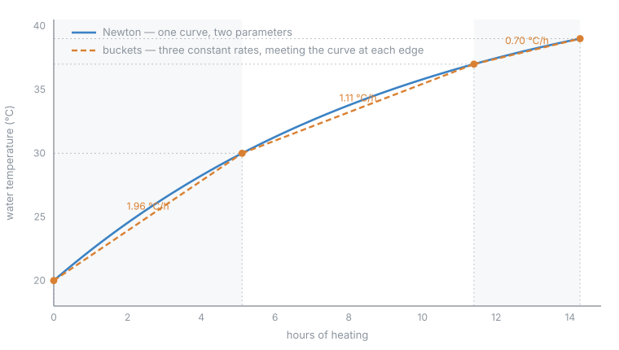

# How the heat-up is predicted

Two models. One ships; the other runs beside it, decides nothing, and is being
measured. This note describes both and the relationship between them.

It is not linked from the README and is not user documentation. The physical model has
not yet been shown to work on a single spa.



The figure is **deliberately exaggerated** — asymptote 45 °C, time constant 10 h. With
this spa's real numbers a heat-up from 28 to 40 °C is very nearly a straight line, the
rate falling only about 14% across eleven hours, and a figure drawn to those values
shows two lines on top of each other. The *relationship* it draws is exact.

---

## The bucket model — what ships

Water heats more slowly as it approaches the setpoint, because losses grow with the gap
to the air. The shipping model approximates that with **three constant rates**, learned
from observation:

| band | span | what it describes |
|---|---|---|
| cold | 20–30 °C | minimal losses, fastest heating |
| mid | 30–37 °C | |
| near-target | 37–39 °C | losses dominate, slowest heating |

Each rate is learned only from a **complete traverse** of its band — entered at one edge
and left at the other — because that is the only span for which a single constant rate
is a meaningful summary. Rates update as an exponential moving average, so a bad night
moves them a little and a season moves them a lot.

An estimate splits the climb at the band edges and sums the segments.

On top of the learned rates sit two corrections. **Outdoor temperature**, applied per
band with a sensitivity that is steepest near the setpoint, where losses matter most and
which is the only place the weather can move the rate appreciably. And what the spa has
shown about its *own* response to the weather, blended in as evidence accumulates and
handed back to the seed when the question moves away from the evidence.

### Why this is a curve pretending to be three lines

In the figure, each dashed chord spans one band and **meets the curve at both its
edges**. That is not a coincidence of the drawing: a bucket rate is `span ÷ time`, the
chord of the curve across that band, so a chord and the curve necessarily agree at the
band edges and disagree in between. Three chords are a piecewise-linear approximation of
a smooth curve — sampled, by construction, exactly at the points the bands are defined
by.

Which is also the model's limitation. It has no mechanism. It cannot say why the rate
falls, only that it does, and every correction for changing conditions has to be bolted
on outside it.

---

## The physical model — what is being measured

Newton's law for a heated body losing heat in proportion to the water–air gap:

```
dT/dt = P/C − (T_water − T_air)/τ
```

Two terms and two parameters. `P/C` is the heater against the thermal mass, a constant.
`(T_water − T_air)/τ` is the loss, growing with the gap. The rate is the difference, so
it falls **linearly** with water temperature — which is why the buckets are a
piecewise-constant approximation of a straight line, and why the curve in the figure is
a smooth exponential approach rather than three segments.

It integrates in closed form, with no segmentation and no bias:

```
t = τ · ln((A − T_start) / (A − T_end)),   A = T_air + P/k
```

`A` is the asymptote — the temperature the water would approach given forever. `P/k` is
how far above the air this heater can hold the water.

### What makes it worth the trouble

**Air temperature stops being learned and becomes an input.** The law fixes its
coefficient at exactly minus the water coefficient, so there is no sensitivity to
calibrate and no reference conditions to pin. Adopting the model deletes the ambient
correction rather than improving it.

**It is falsifiable.** Regress rate on water *and* air separately, and the two
coefficients must come out equal and opposite. Nothing about a curve fit forces that. On
639 clean hours from a previous spa they came out −0.0161 and +0.0167 — equal and
opposite to within 4%, on coefficients individually significant at t ≈ 12 — and the fit
beat the buckets on the same data with one parameter fewer.

**The heater's power is known**, so `P/C` yields the thermal mass and with it an
equivalent volume in litres, which can be held against the nameplate. That is a second,
independent way for the model to be caught being wrong, and it costs nothing.

### Priming

Eight recorded traverses are needed before the model can fit itself, which is several
weeks of ordinary use. Until then it is **primed from the learned buckets**: a bucket is
one point on the line the law describes, and three buckets place a line that needs two.
The priming is refused outright when the bucket shape implies a spa that sheds almost no
heat, and dropped entirely — not blended — the moment real traverses can carry the fit.

---

## How the two relate

| | buckets | Newton |
|---|---|---|
| parameters | 3 learned rates | 2: `τ` and `P/k` |
| shape | piecewise constant | linear in water temperature |
| air temperature | a correction bolted on outside | a term inside the equation |
| falsifiable | no | yes, two ways |
| ships | yes | no |

Both are reached through one function, so switching moves no entity: the same sensors
keep the same ids and the same meaning, and only the arithmetic behind them changes. The
switch is deliberately not offered in the options dialog while the model is unproven.

Two diagnostic sensors — **Newton ready at** and **Newton start at** — report what the
physical model would have said, recomputed every poll and deciding nothing. Every
finished session is priced by both and scored against what actually happened, so the
question is settled by heat-ups rather than by argument.
